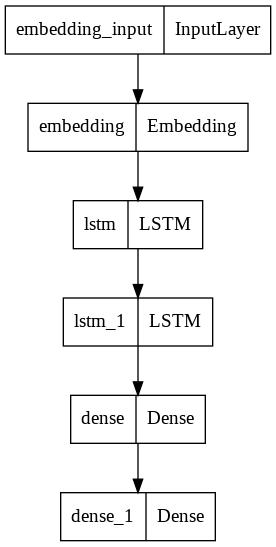

# AI自动补全vscode插件

这个插件为vscode提供了自动补全的功能，通过训练数据，预测下一个要输入的字符串， 其中用到vscode的 `CompletionItemProvider` api.

### LSTM 预测模型

### How to start
#### 服务端
- pip3安装服务端依赖 (python)
- 下载nxtmodel.h5, 放入next_word文件夹中 (https://drive.google.com/file/d/15oIB0NdB9uHHzeSEOLOnigDAycd7dgfo/view?usp=sharing)
- 启动server，(server会，加载训练好的模型nxtmodel.h5，并根据请求返回预测结果)
	 - export FLASK_APP=server
	 - flask run （默认端口5000）
#### 客户端
- vscode 打开项目
- npm 安装客户端依赖 (nodejs)
- rm -rf ./out (删除out文件夹)
- npm run compile
- fn + F5，运行插件，弹出新的vscode编辑器
- 在这个新的编辑器中，创建一个js文件
- 输入一段文字，然后 option + esc 快捷键，弹出我们的AI智能补全提示
### `vscode` module

- [`languages.registerCompletionItemProvider`](https://code.visualstudio.com/api/references/vscode-api#languages.registerCompletionItemProvider)
